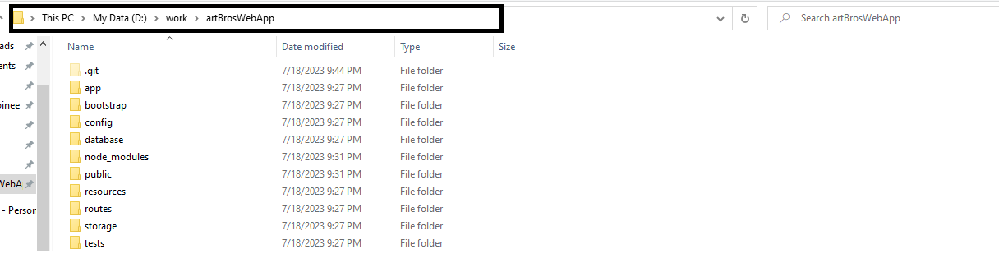
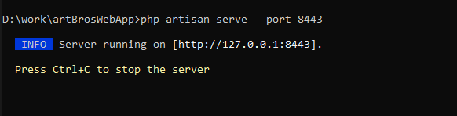

# Art Bros Web App
### Developed By: Titus Silver

## Installation
- 1. Make sure to install php in your system either in php official page: `https://www.php.net/downloads` or you can install xampp which has already built in mysql and php: `https://www.apachefriends.org/download.html`
- 2. Download composer and install in your system:  `https://getcomposer.org/download/`
- 3. Install git bash if you didn't install it yet on your system: `https://git-scm.com/download/win`
- 4. Clone this repository using git bash, open a directory where you want to put your repository and open git bash by right clicking on the directory and type this command: `git clone https://github.com/MakMoinee/artBrosWebApp.git`
- 5. After cloning the repository, a folder named artBrosWebApp will be available, go to that folder
- 6. Open the command prompt by typing cmd in the address bar, see picture below:
- 
- 7. Type in the cmd : `php artisan serve --port 8443`
- 8. It will have a log saying `Server running on [http://127.0.0.1:8443]`, meaning it successfully started the web application:
- 
- 9. Open the browser, copy and paste this link: `http://localhost:8443`